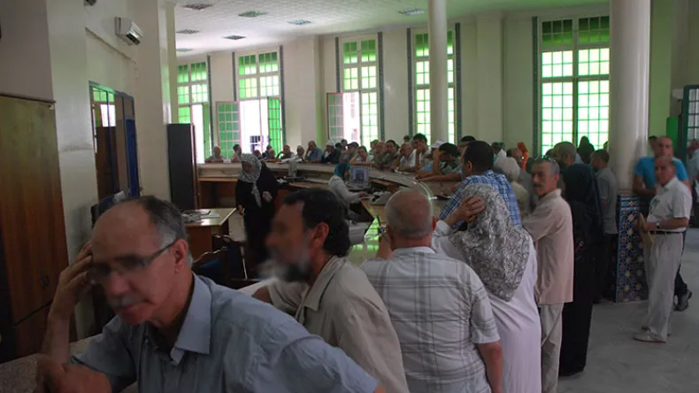
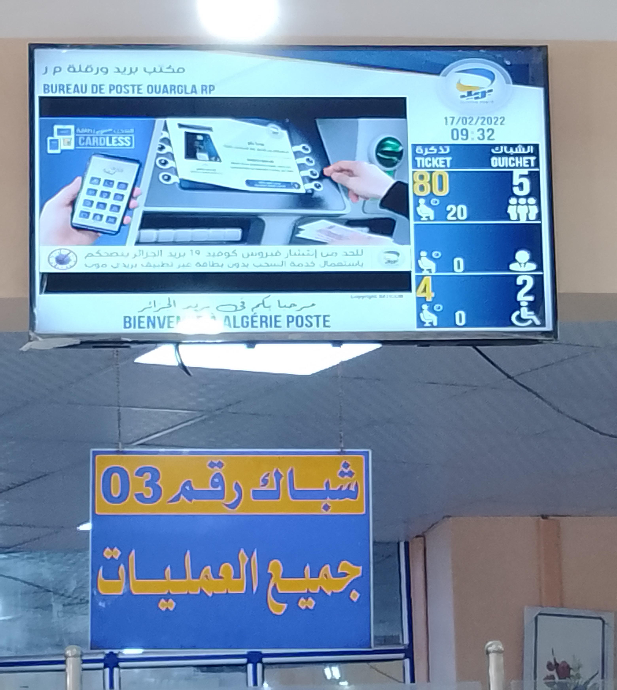
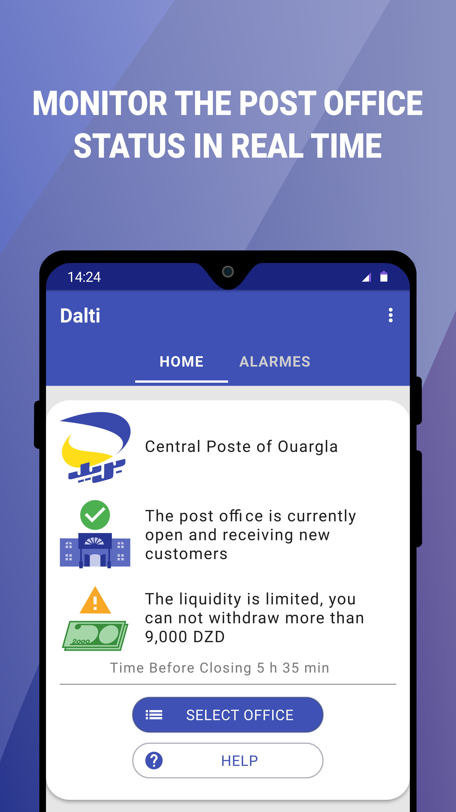
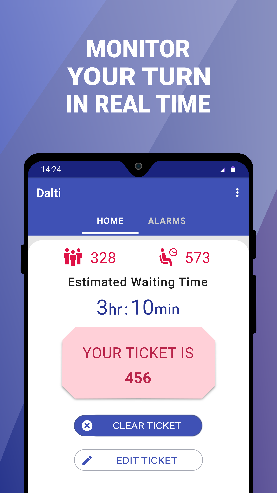
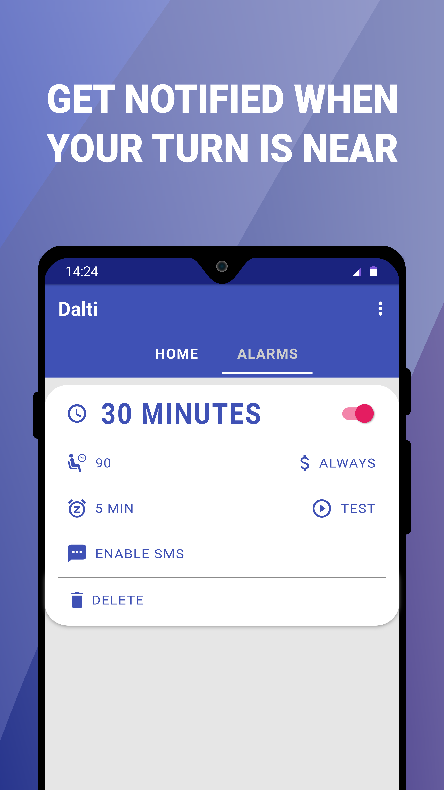
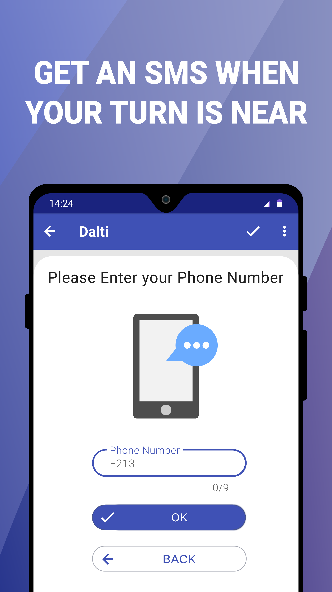
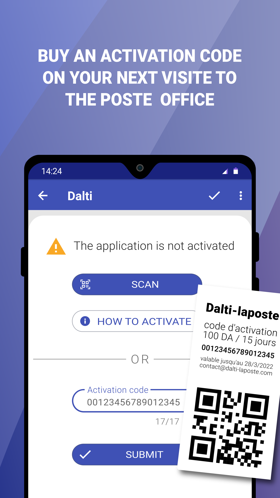

## Overview

This is working prototype of an Android application that keeps users updated on the status of waiting queues at Algerian Post Offices, users can receive an Android notification or an SMS, when their turn is approaching.

In Algeria, government post offices have effectively replaced the banks, even the Algerian national bank cannot compete with them, the main reasons for this monopoly are:

- **Cheap Prices** A post Office offer All basic services of a bank agency like: deposit, withdraws and account-to-account transactions at symbolic prices, however they don't provide other services like lending money or financing commercial projects, etc.
- **Availability** Even remote and underpopulated areas has at least one post office nearby.
- **Reliability** From time to time when a liquidity shortage hit the Algerian banking system, the Central Bank prioritise supplying the cash to the post offices over the banks.

This monopoly is deliberate, as part of the government plan to support the workers class, but one of consequences of this monopoly is an always-empty bank agencies and unbelievably crowded post offices especially on saturdays (weekends) and from the 18th to the 22th of every month (public service payment days).

*Image: A crowded Algerian post office on a busy day.*

This is where the idea of this project came from, what makes the project even more feasible is the fact that most Post offices already have a queue management system with a tickets distribution machines and a monitor that show the current ticket, this system is connected through a private WAN network across the country, so the Algeria Post HQ can keep its dashboard updated in real-time.

*Image: The queue monitoring system at an Algerian post office.*

## Project objectives 

After presenting the idea to the Algerian post office administration we learned that there was government project in 2018 to implement a website that allows the users to book a ticket to visit any post office, but after testing in on a single post office there was a commotion caused by people who "came first" and the others who "booked their ticket online" and because of this incident the whole website project got abandoned. More importantly our team cannot negotiate with the administration of Algerian post about any kind of 3rd party integration with their backend servers before satisfying two conditions:

+ We need to create a company that is legally labeled as "startup" by the ministry 
+ We must have a "concrete" and "working" application

As a result "Dalti-laposte" project started with these objectives:

- **Conducting a market study** Since the clients are very specific (Post office visitors), conducting an on-site market study is both convenient and rewarding, since a board client waiting in the queue is usually more that happy to answer a survey to pass the time.  
- **Implementing the client App** This is the main product of the project. It should be totally functional except a few features that can not be added (for legal reasons) until after we sign the partnership contract (E-Payment for example).
- **Implementing the backend** Naturally the android app needs a backend server to work, it should be fully functional and production ready, however the waiting estimation time can be calculated using a simple algorithm that only takes into account the serving rate of the current day, in the production version this estimation should be calculated with the help of a neuron network that is trained using real-word data, the Algerian Post HQ has such data (from 2017 onward) but won't share it with us until we sign the partnership contract.
- **Implementing the admin App** The "admins" are our field agents, for each post office we support we intend to have at least one "admin" on-site as long as the post office is open, the "admins" are needed for a variety of reasons like: introducing the app to potential clients, providing an on-site basic tech support, selling activation codes, register SMS notifications for clients without a compatible Android device, and sending queue state updates to the backend (current ticket, waiting count, liquidity state, etc.), this manual updating is crucial when the post office network is down (happens almost daily).
- **Setting up logistics** This includes: recruiting/training agents, printing banners/posters/flyers, preparing T-shirts (with our logo), and negotiating with a few shop owners near the supported post offices to act as selling points to our activation codes.
- **Testing the service** Before presenting the project to the micro-enterprises incubation center or the Algerian Post HQ the whole system needs to be tested for at least 1 month so that we can confidently say that we have a "working" prototype
- **Getting the "startup" label** As Algerian Post HQ requested, we first need to subscribe the project as a "startup" in the [National Agency of Tech Parcs (ANPT in French)](https://anpt.dz), after getting our incubation contract from this agency we will be officially recognized micro-enterprise labeled as a "startup", all the previews objectives are meant to increase our chances of achieving this 
- **Signing the partnership contract** This is the main goal of the project, after signing a partnership contract with the Algerian Post HQ we can plan the next steps from there on, basically all what we want is two things, first the permission to access their backend API (to synchronize our server with theirs) and a copy of the archived queue data of the last few years (we need it to train our AI model on predicting waiting times) 

## Project Status

Currently, the project's development is on hold, and the server is offline due to the refusal of the [National Agency of Tech Parcs (ANPT in French)](https://anpt.dz) to enroll our project in their new enterprise support program. The refusal is based on "legal reasons" since there are no established regulations for integrating a 3rd party service with the Algerian Post infrastructure.

- [x] **Market Study:** We conducted a market study that included more than 300 surveys from three post offices (almost 1000 surveys in total) over a three-week period. The study revealed promising insights, with 88.9% of visitors having compatible Android devices with our app, 64.71% finding our service useful, and 24.7% expressing willingness to pay for the service on a regular basis. The most favored price point was 100DZD for a 15-day subscription.
- [x] **Client App:** We developed and made the Client App available on the Google Play Store from 2021 to 2022.
- [x] **Backend:** The backend server has been fully implemented and was operational for nearly two years.
- [x] **Admin App:** The admin app was implemented but not uploaded to the Play Store. Instead, it was manually distributed to administrators. This app empowers administrators with their own activation codes list, enabling them to sell activation codes and efficiently manage post office operations. The app even includes a floating overlay feature that allows admins to update the queue status while performing other tasks on their devices. It also offers the option to register SMS notifications for clients without compatible Android devices.
- [x] **Logistics:** During the active phase of the project, we successfully addressed all logistics requirements. However, it's important to note that the agents team has been disbanded, and the agreements with shops intended to serve as activation code sales points have been revoked.
- [x] **Testing:** Extensive testing was conducted for more than 45 days in one post office, during which free activation codes were distributed to all visitors to gather real feedback.
- [ ] **The "Startup" Label:** Unfortunately, our application was denied the "startup" label due to "legal reasons."
- [ ] **Partnership Contract:** The partnership contract cannot be finalized until we obtain the "startup" label for our enterprise.
We appreciate your understanding and support as we navigate the legal challenges that are currently affecting our project's progress.

## Application Features

## Implementation Details

This repository actually contains two Android applications: the [client app](client) (for users) and the [admin app](admin) (for our field agents). Each app has its own module. The [core](core) module contains code common to both of them, while the [silverbox](silverbox) module contains code shared with other similar projects.

All modules are implemented in Java. We use several libraries, including Retrofit, Guava, Espresso, and multiple Android Jetpack libraries (Hilt, Room, Camera, Paging, etc.), among others. Firebase services are employed to implement various features such as push notifications, logging, and crash reports.

Because the minimum supported Android version is 5.0, all image resources, are provided in vector format. This approach ensures better support for all devices with a smaller download size.

The code in this repo is nearly complete; it lacks only a few tests (which are not needed to build the app) and Google Services JSON files (one per app module), you can obtain these files by creating your own Firebase account. Additionally, there are a few small private libraries needed to compile the code. If you want to compile the code, you can either clone the project and refactor the problematic parts yourself or [Contact US](#contact-us).

## Licence

This project is licensed under the [Apache License 2.0](LICENSE.txt).

You are free to:

- **Share:** Copy and redistribute the material in any medium or format.
- **Adapt:** Remix, transform, and build upon the material for any purpose, even commercially.

Under the following terms:

- **Attribution:** You must give appropriate credit, provide a link to the license, and indicate if changes were made. You may do so in any reasonable manner, but not in any way that suggests the licensor endorses you or your use.
- **No Additional Restrictions:** You may not apply legal terms or technological measures that legally restrict others from doing anything the license permits.

For more details about the Apache License 2.0, please refer to the [LICENSE](LICENSE.txt) file.

## Contact Us

If you have any questions or inquiries about this project, please don't hesitate to contact the main developer at [youcef-debbah@hotmail.com](mailto:youcef-debbah@hotmail.com).